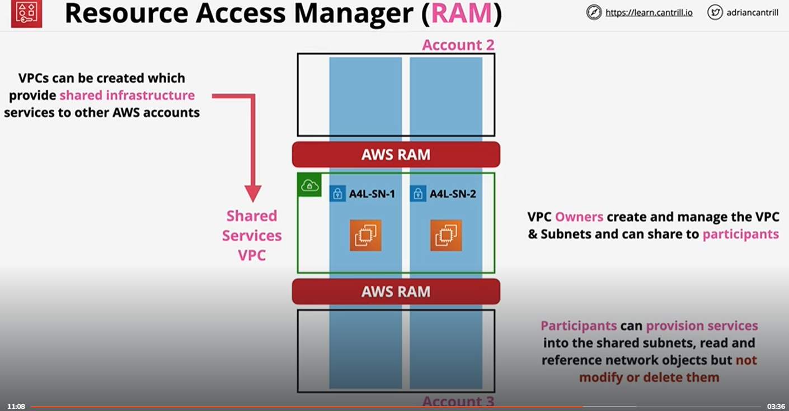

# AWS Resource Access Manager - RAM

- Allows sharing resources between AWS accounts
- Some services may allow sharing between any AWS accounts, some allow sharing only between accounts from the same organization
- Services needs to support RAM in order to be shared (not everything can be shared)
- Services can be shared with principals: accounts, OU's and ORG
- Shared resources can be accessed natively
- There is no cost by using RAM, only the service cost may apply
- AWS RAM for sharing resources in an organization can be enabled with `enable-sharing-with-aws-organizations` CLI command. This operation creates a service-linked role called `AWSServiceRoleForResourceAccessManager` that has the IAM managed policy named `AWSResourceAccessManagerServiceRolePolicy` attached. This role permits RAM to retrieve information about the organization and its structure. This lets us share resources with all of the accounts

## Availability Zone IDs

- A region in AWS has multiple availability zones, example: `us-east-1a`, `us-east-1b`, etc.
- AWS rotates the name of the AZs depending on the AWS account, meaning that `us-east-1a` may not be the same AZ if we compare 2 accounts
- If a failure happens on the hardware level, two accounts may see the issue being in different AZ, this may introduce a challenge in troubleshooting
- AWS provides AZ IDs to overcome this challenge. Example of IDs: `use1-az1`, `use1-az2`
- AZ IDs are consistent across multiple accounts

## RAM Concepts

- **Owner account**: 
    - Owns the resource, creates a share, provides the name
    - Retains full permission over the resource shared
    - Defines the principal (AWS account, OU, entire AWS organization) with whom the share a specific resource
- **Principle**:
    - It can be an AWS account, OU, entire AWS organization
    - Resources are shared with a principle
- If the participant is inside an ORG with the sharing enabled, sharing is accepted automatically
- For non ORG accounts, or sharing with AWS Organizations is not enabled, we have to accept an invite

## Shared Services VPC

- It is a VPC which provides infrastructure which can be used by other services
- In AWS this has been traditionally architected using separate networks connected using VPC peering or Transit Gateways. With AWS RAM and AWS Organizations we can create something which is more effective:
    
- VPC owner can create and manage the VPC and subnets which shared with participants
- Participants can provision services into the shared subnets, can read an reference network objects but can not modify or delete the subnets
- Resources created by a participant account will not be visible for other participants or by the VPC owner account
- Resources created by a participant account can be accessed from other resources created by other participant accounts because they are on the same network