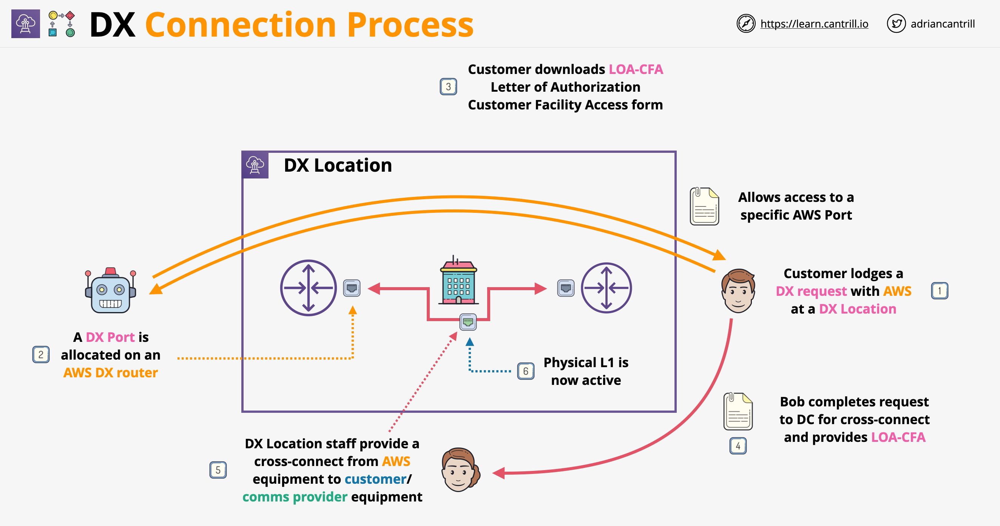
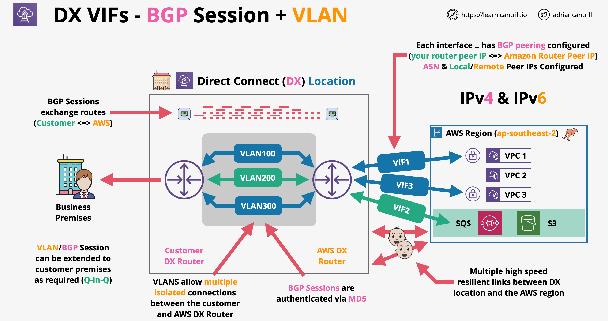
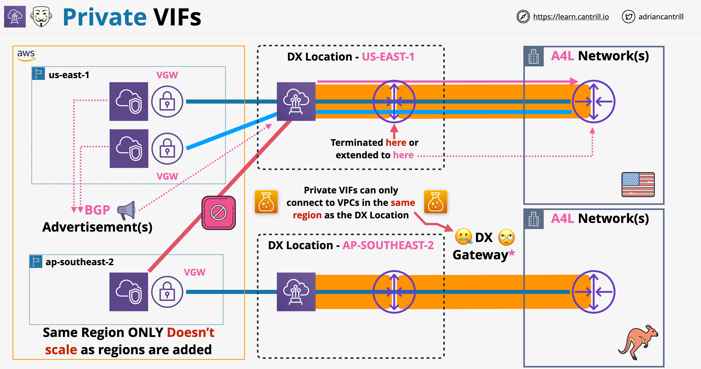
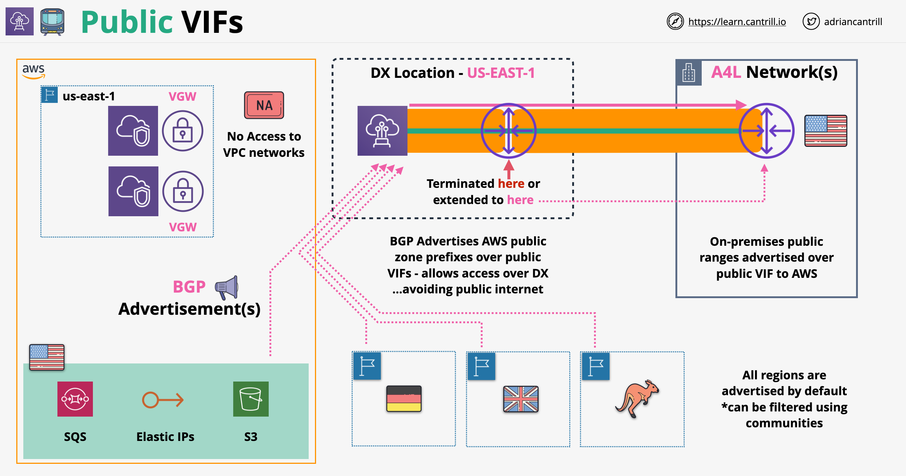
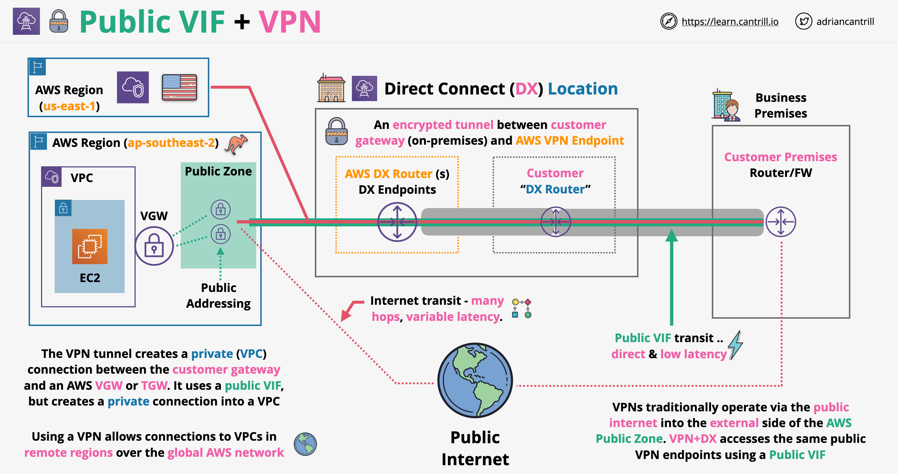

# DX - Direct Connect

- It is a physical entry point into the AWS network
- It is a physical fibre connection through which we can access AWS services without sending traffic through the public internet
- The connection is between the business premises => DX Location => AWS Region
- When we order a DX connection, what we order is actually a Port Allocation at a DX Location
- The port has 2 costs:
    - Hourly cost based on the DX location and speed of the port
    - Outbound data transfer, inbound data transfer is free of charge
- In order to get a Direct Connect we have to create a connection (logical entity) inside an AWS account. This connection will have an unique ID
- Provisioning time: weeks/months of extra time
- DX provides low and consistent latency + high speeds (1/10/100 Gbps)
- In the DX location we will have to install a cross-connect (physical cable) in order to connect our own network to the AWS network

## DX Physical Connection Architecture

- A Direct Connect is a physical port allocated at a DX Location
- This physical port provides 1, 10 or 100 Gbps speed
- DX can be ordered directly from AWS or through partners (wider range of speeds, with less options)
- The port requires single-mod fibre, NO copper cable connection supported
- Depending on the speed we order we will interface with DX using the following standards:
    - **1000BASE-LX** (1310 nm) Transreceiver for 1 Gbps
    - **10GBASE-LR** (1310 nm) Transreceiver for 10 Gbps
    - **100GBASE-LR4** - 100 Gbps
- Auto-Negotiation should be disabled for the connection
- We configure the port speed, full-duplex should be manually set on the network connection
- The router in the DX location should support Border Gateway Protocol (BGP) and BGP MD5 Authentication
- Optional configurations:
    - MACsec
    - Bidirectional Forwarding Detection (BFD)

## Direct Connect - MACsec

- It is a security feature that improves/partially improves a long-standing problem with DX: lack of builtin encryption
- It is a standard which allows frames on the network to be encrypted. Frames are the unit of data which occur at the layer 2 of the OSI model
- MACsec provides a hop by hop encryption architecture => 2 devices need to be next to each other at layer 2 to order MACsec (layer 2 adjacency)
- MACsec features:
    - Confidentiality: strong encryption at layer 2 by encryption the frame's EtherType and payload
    - Data integrity: adds additional fields to ensure that data cannot be modified in transit without both parties being able to detect the modification
    - Data origin authenticity: both parties can see that frames were been sent by other trusted peer
    - Replay protection
- MACsec does not replaces IPSEC over DX, it is not end-2-end!
- It is designed to allow transfer for super high speeds for terabit networks
- MACsec key components:
    - **Secure Channel** (unidirectional): each MACsec participant creates a MACsec channel that is used to send traffic
    - **Secure Channels** are assigned an identifier (SCI): uniquely identifies a secure channel
    - **Secure Associations**: communication that occurs on each secure channel, takes place as a series of transient sessions, multiple secure associations will take place on each secure channel over the lifetime of the connection. Each secure channel generally has 1 secure association at a time (exception when the associations are being replaced)
    - **MACsec encapsulation**: 16 bytes MACsec tag & 16 bytes of Integrity Check Value (ICV). MACSec modifies Ethernet frames by inserting these tags
    - **MACSec Key Agreement** protocol: manages discovery, authentication and key generation
    - **Cipher Suite**: controls how the data is encrypted: algorithm, packets per key, key rotation
- MACsec can be defined either ona DX connection on a Link Aggregation Group (LAG)
- Configuring MACsec: we associate a CAK/CKN pair with the connection on both the AWS DX router(s) and customer side's router
- It is possible to extend MACsec from the DX location ot the customer side
- This requires a dedicated physical extension of the cross connect to the business premises; this type of extension requires Layer 2 Adjacency

## DX Connection Process

- A DX connection begins in a DX Location, which contains AWS equipment and also customer/provider equipment
- AWS does not own this facility (neither does the provider) - it is a data center owned by a third party
- A large data center is collection of cages, these cages are areas that specific customers rent
- Only the staff at the data center can connect stuff together, only they have access to the space in-between the cages to connect different cages together
- Connecting these cages can be done only by staff members only when they have authorization from all parties
- The authorization is called **Letter of Authorization Customer Facility Access (LOA-CFA)**
- It is form that gives the access from one customer to get the data center staff to connect to the equipment of another customer
- DX connection process:

## DX Virtual Interfaces BGP Sessions + VLAN

- DX Connections are a layer 1 connections (physical cables) running layer 2 protocols (Data Link)
- We need a way to connect to multiple types of layer 3 (IP) networks (VPCs and public zones) over a single DX connection => this is where Virtual Interfaces (VIFs) come in handy
- VIFs allows us to run multiple layer 3 networks over a layer 2 direct connect
- A VIF is simply a BGP Peering Session => something which exchanges prefixes which allow traffic to be router to one point to the other
- All of this is isolated within a VLAN
- A VLAN isolates different layer 3 networks using VLAN tagging
- BGP exchanges prefixes, which means each end knows which networks are at each side; BPG MD5 authentication means that only authenticated data will accepted by either type
- 3 types of VIFs can be run over DX:
    - Private VIF: used to connect ot AWS private networks, so VPCs
    - Public VIF: used to connect to Public Zone Service
    - Transit VIF: allow integration between DX and Transit Gateways

- A single dedicated DX can have in total 50 public/private VIFs, as well as 1 Transit VF
- Hosted VIFs: we can share VIFs with other AWS accounts. Can be connected to a virtual private gateway in a VPC of the other account

## Private VIFs

- They are used to access the resources inside 1 AWS VPC using private IP addresses
- Resources can be accessed with their private IP using private VIFs, public IPs and Elastic IPs wont work
- Private VIFs are associated with a Virtual Private Gateway (VGW) which can be associated to 1 VPC. This has to be in the same region where the DX location connection terminates
- 1 Private VIF = 1 VGW = 1 VPC (there are ways around this using Transit VIFs)
- There is no encryption on private VIFs, DX is not adding encryption and neither is the private VIFs (there are ways around this, example using HTTPS)
- With private VIFs we can use normal or Jumbo Frames (MTU of 1500 or 9001)
- Using VGW, route propagation is enabled by default
- Creating private VIFs:
    - Pick the connection the VIF will run over
    - Chose VGW (default) or Direct Connect Gateway
    - Chose who owns the interface (this account or another account)
    - Choose a VLAN id - 802.1Q which needs to match the customer config
    - We need to enter the BGP ASN of on-premises (public or private). If private use 64512 to 65535
    - We can choose IPs or auto generate them
    - AWS will advertise the VPC CIDR range and the BGP Peer IPs (`/30`)
    - We can advertise default or specific corporate prefixes (**max 100** - this is HARD limit, the interface will go into an idle state)
- Private VIFs architecture:
    
 - Key learning objectives:
    - Private VIFs are used to access private AWS services
    - Private VIF => 1 VGW => 1 VPC
    - VPC needs to be in the same region as the DX location
    - VGW has an AWS assigned
    - Over the private VIF runs the BGP with IPv4 or IPv6 (separate BPG peering connections)
    - We configure our own AS on the VIF, which can be private ASN or public ASN

## Public VIFs

- Are used to access AWS public zone services: both public services and services which have a public Elastic IP
- They offer no direct access to private VPC services
- We can access all public zone regions with one public VIF across AWS global network
- AWS advertises all AWS public IP ranges to us, all traffic to AWS services will go over the AWS global network
- We can advertise any public IPs we own over BGP, in case we don't have public IPs, we can work with AWS support to allocate some to us
- Public VIFs support bi-directional BGP communities
- Advertised prefixes are not transitive, our prefixes don't leave AWS
- Create a public VIF:
    - We pick the connection the VIF will run over
    - We chose the interface owner (this account or another)
    - Chose VLAN - 802.1Q, which needs to match the customer configuration
    - Chose the customer side BGP ASN (ideally this is public ANS for full functionality offered by public VIFs)
    - Configure authentication and select optional peering IP addresses
    - We have to select which prefixes we want to advertise
- Private VIFs architecture:

## Direct Connect Public VIF + VPN

- Using a VPN gives us an encrypted and authenticated tunnel
- Architecturally, having a VPN over DX uses a Public VIF + VGW/TGW public endpoints
- With a VPN we connect to public IPs which belong to a VGW or TGW
- A VPN is transit agnostic: we can connect using a VPN to VGW or a TGW over the internet or over DX
- A VPN is end-to-end encryption between a Customer Gateway (CGW) and TGW/VGW, while MACsec is single hop based
- VPNs have wide vendor support
- VPNs have more cryptographic overhead compared to MACsec
- A VPN can be provided immediately, can be used while DX is provisioned and/or as a DX backup

## Direct Connect Types

- There are a few ways to get a DX:
    - Get the connection directly from AWS
        - Offers to speed options 1 Gbps, 10 Gbps amd 100 Gbps
        - We get a port at a DX location, from which we have to arrange to connection to our location
        - We can run 50 VIFs + 1 transit VIF
    - Get the connection via partner
        - Offers wider range of speeds from 50Mbps up to 10Gbps
        - Hosted Connection: DX connection hosted an managed by the partner with **one VIF**
        - Hosted VIF individually: less ideal than a hosted connection, no dedicated bandwidth allocated

## Direct Connect - Other Notes

- Direct Connect offers no end-to-end encryption!
- To overcome this: create a public VIF and establish a Site-to-Site VPN over it
- With direct connect we do not share any data cap with internet providers
- No transit over the internet, which means low and consistent latency
- DX offers cheaper data transfers and faster speeds compared to other methods
- VPC endpoints can not be accessed through Private VIFs!

## Direct Connect Resilience and HA

- To improve resilience:
    - Order 2 DX ports instead of one => 2 cross connects, 2 customer DX routes connecting to 2 on-premises routes
    - Connect to 2 DX locations, have to customer routers and 2 on-premises routers in different buildings (geographically separated)
- Not resilient DX architecture:

- Resilient DX architecture:

- Improved resilient DX architecture:

- Extreme resilient DX architecture:

## Direct Connect Link Aggregation Groups (LAG)

- LAG: allows to take multiple physical connections and configure them to act as one
- From speed perspective: the speed increases linearly depending on the number of connections
- LAG do provide resilience, although AWS does not market them as such. They do not provide any resilience regarding hardware failure or the failure of entire location
- LAGs use an Active/Active architecture, maximum 4 connection can be part of the LAG
- All connections must have the same speed and terminate at the same DX location
- `MinimumLinks`: the LAG is active as long as the number of working connections is greater or equal to this value

## Direct Connect Gateway and Transit VIFs

- Direct Connect is a regional service
- It is a link from a customer premises to one or more DX locations
- Public VIFs can be used to access public services in all public AWS regions
- Private VIFs can only connect to VPCs in the same region by default via VGWs
- Direct Connect Gateway:
    - It is a global network device accessible in all regions
    - Direct Connect integrates with a Direct Connect Gateway using a private VIF. This VIF is associated with the Direct Connect Gateway (not with the VGWs from the VPC)
    - On the AWS side we create VGW associations in any VPC in any regions. This connects those VPCs to the DX gateway and onwards using the private VIF into on-premises network
    - Direct Connect Gateway does not allow VPCs to communicate with each other, it allows only on-prem network to communicate with AWS VPCs
- We can have 10 VGW attachments per DX Gateway

- Integrate DX Gateways with Transit Gateways:
    - Transit Gateways can be integrated with DX Gateways using a transit VIF
    - We can have 1 transit VIF per DX connections
    - Transit VIF is associated with DX gateway and allows associations between the DX gateways and 3 transit gateways
    - Transit gateways can be peered
