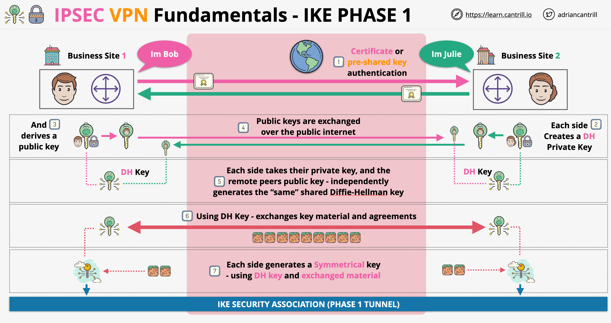
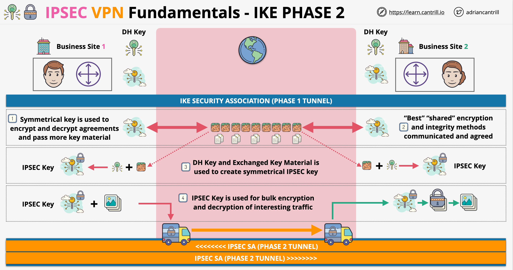
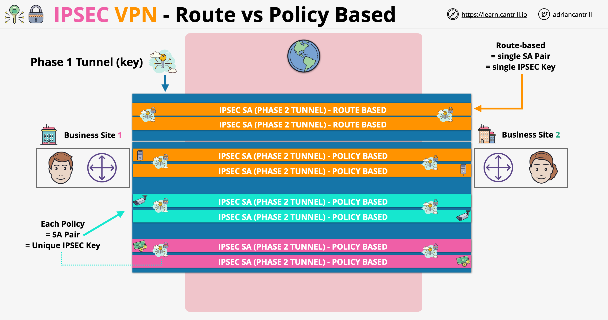

# VPNs

# IPSEC VPN Fundamentals

- IPSEC is a group of protocols
- Their aim is to set up secure tunnels across insecure networks. Example: connect two secure networks (peers) over the public internet
- IPSEC provides authentication
- Any traffic transferred through IPSEC is encrypted
- IPSEC is using asymmetric encryption to exchange symmetric keys and use these of ongoing encryption
- IPSEC has 2 main phases:
    - IKE (Internet Key Exchange) Phase 1
        - It is slow and heavy
        - It is a protocol of how keys are exchanged
        - It has 2 versions v1 (older) and v2 (newer)
        - Uses asymmetric encryption to agree on and create a shared symmetric key
        - The end of this phase is an IKE SA (security association) phase 1 tunnel
        
    - IKE Phase 2
        - It is faster and more agile
        - Uses the keys agreed in phase 1
        - Is concerned with agreeing on encryption method and keys used for bulk data transfer
        - The end result is an IPSEC SA phase 2 tunnel (runs over phase 1)
        
- There are two types of VPNs - how they match traffic:
    - Policy based VPNs: rule sets match traffic, we can have different rules for different types of traffic
    - Route based VPNs: target matching is done based on prefix. We have a single pair of security associations for each network prefix (less functionality, much simpler to set up)
    

## AWS Site-to-Site VPN

- A Site-to-Site VPN is a logical connections between a VPC and an on-premise network running over the public internet. The connection is encrypted using IPSec
- Can be fully HA if it is implemented correctly
- It is quick to provision, it can be provisioned in less than an hour (contrast to DX)
- Components involved in creating a VPN connection:
    - **VPC**
    - **Virtual Private Gateway (VGW)**: it is a gateway object which can be the target of one or more rules in a Route Tables. It can be associated to a single VPC
    - **Customer Gateway (CGW)**: can refer to 2 different things:
        - Often is referred to the logical configuration in AWS
        - Physical on-premises router which the VPN connects to
    - **VPN Connection** itself: the connection linking the VGW from the AWS to the CGW
- Static vs Dynamic VPN:
    - **Static VPN**:
        - Uses static network configuration: static routes are added to the route tables AWS side, static networks has to be identified on the VPN connection on-premise side. 
        - It is simple, it just uses IPSec, works anywhere, having limitation on terms of load-balancing and multi-connection failover
    - **Dynamic VPN**:
        - Uses BGP protocol, if customer router does not support BGP, we can not use dynamic VPNs
        - BGP: allows routing on the fly, allows multiple links to be used at once between the same locations. Allows using HA available architectures
        - Static routes can still be added to the route tables manually
        - Route propagation: if enabled means that routes are added ro the Route Table automatically
- Considerations for VPN:
    - Speed Limitation for VPN with 2 tunnels: *1.25 Gbps*, AWS limitation. Customer router limitation might also apply
    - Latency considerations: can be inconsistent if the traffic goes through the public internet
    - Cost: hourly cost for outgoing traffic, on-premises data caps might also apply
    - Speed of setup: can done very quickly, within hours or less; IPSec is supported by a wide variety of devices, BGP support is less common. VPNs are always quicker to setup then any other private connection technologies
    - VPNs can be used for Direct Connect backup or they can be used over the Direct Connect for adding a layer of encryption

### Accelerated Site-to-Site VPN

- Performance enhancement for AWS Site-to-Site VPN that uses the AWS global network, the same network used for Global Accelerator and CloudFront
- Using a classic Site-to-Site VPN, the traffic goes through the public internet. In order to avoid this, some companies use a Site-to-Site VPN over Direct Connect. Direct Connect offers more better performance, but at a higher cost. Since DX is not an option for everybody, accelerated Site-to-Site VPN was created to improve performance compared to classic Site-to-Site VPNs
- Accelerated Site-to-Site VPN architecture:

- Acceleration can be enabled when creating a Transit Gateway attachment only! Not compatible with VPNs using Virtual Private Gateways (VGW)
- Accelerated Site-to-Site VPN has a fixed accelerator cost fee and a data transfer fee

## Client VPN

- Site-to-Site VPN is generally used for one or more business premisses to connect to AWS VPCs. ClientVPN is similar, but instead of sites connecting to AWS, we have individual clients
- A ClientVPN is a managed implementation of OpenVPN
- Any client device which can use the OpenVPN software is supported
- Architecturally we connect to a Client VPN endpoint which can be associated with one VPC and with one ore more Target Networks (high availability)
- Client VPN billing is based on network association and hourly fee for usage
- Client VPN setup:
    - We crate a Client VPN Endpoint and associate it with a VPC and one or more subnets from the VPC
    - This association places an ENI into the subnets associated
    - We can only pick one subnet per AZ
- Client VPN can use many different methods of authentication (certificates, Cognito User Pool, Federated Identities,  AWS Directory Service)
- We associate a route table to the Client VPN Endpoint in order to set up routing and connectivity (to internet via NAT Gateways, other VPCs with peering, etc.)
- This route table is pushed to any client which connects to the Client VPN Endpoint
- The default behavior is the Client VPN route table replaces any local routes on the client, meaning the client devices can not access anything locally on their local network without having communication going through the Client VPN Endpoint
- We can use split tunnel VPN, meaning that any routes from the Client VPN Endpoint are added to local client route tables. This solves the problem with the default behavior
- Split tunnel is not the default behavior. It must be enabled by the user, otherwise all the data (including connection to the public internet) will go via the tunnel