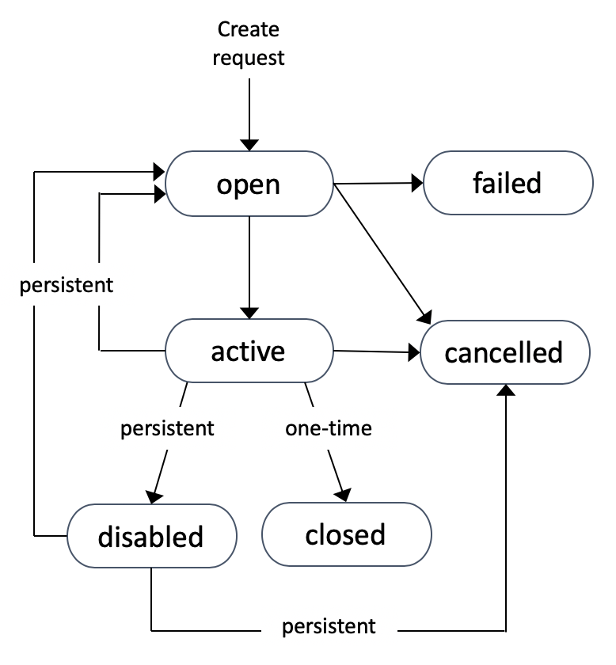

# EC2

## EC2 Purchase Options (Launch Types)

- **On-Demand (default)**:
    - Average of anything, no specific cons of pros
    - On-demand instances are isolated but multiple customer instances run on a shared hardware
    - Multiple instance types (different sizes) can run on the same EC2 hosts, consuming a different allocation of resources
    - Billing: per-second billing while an instance is running, if a system is shut down, we don't get billed for that
    - Associated resources such as storage consume capacity, we will be billed regardless the instance is running or it is stopped
    - We should always start the evaluation process using on-demand
    - With on-demand there are no interruptions. We start an instance and it should run as long as we don't decide to shut it down
    - In case of resource shortage the reserved instances receive highest priority, consider them instead of on-demand in case of business critical systems
    - On-demand offers predictable pricing without any discount options
- **Spot instances**:
    - Cheapest way to get EC2 compute capacity
    - Spot pricing is selling EC2 capacity at lower price in order make use of spare EC2 capacity on the host machines
    - If the spot price goes above selected maximum price, our instances are terminated
    - We should never use the spot instances for workloads which can't tolerate interruptions
    - Anything which can tolerate interruptions and can be re-triggered is good for spot
- **Standard Reserved Instances**:
    - On-demand is generally used for unknown or short term usage, reserved is for long term consistent usage of EC2
    - Reservations:
        - They are commitments that we will use a instance/set of instances for a longer amount of time
        - The effect of a reservation is to reduce the per second cost or remove it entirely
        - Reservation needs to be planned in advance
        - We pay for unused reservations
        - Reservations can be bought for a specific type of instances. They can be region and AZ locked
        - Az locked instances reserve EC2 capacity
        - Reservations can have a partial effects in a sense the we can get discounts for larger instances compared to which the reservation was purchased
        - We can commit to reservations of 1 year of 3 years
        - Payment structures:
            - No upfront: we pay per second a lower amount of fee compared to on-demand. We pay even if the instance is not used
            - All upfront: the whole cost of the 1 or 3 years. No second per fee payment will be required. Offer the greatest discount
            - Partial upfront: we pay a reduced fee upfront for smaller per second usage
    - Reserved instances are good for components which have known usage, require consistent access for compute for a long term basis
- **Scheduled Reserved Instances**:
    - Great for long term requirements which does not run constantly, ex. batch processing running 5 hours/day
    - For scheduled reserved instances we specify a time window. The capacity can be used only during the time window
    - Minimum purchase per year is 1200 hours, minimum commitment is 1 year
- **Dedicated Hosts**:
    - They are EC2 hosts allocated to a customer entirely
    - They are hosts designed for specific instances, ex. A, C, R, etc.
    - Hosts come with all of the resources we expected from a physical machine: number of cores and CPUs, memory, local storage and connectivity
    - We have a capacity for a dedicated hosts, we can launch different sizes of instances based on the available capacity
    - Reasons for dedicated hosts: we want to use software which is licensed for number of cores or number of sockets
    - Host affinity: links instances to hosts, if we stop and start the instance, it will remain on the same host
- **Dedicated Instances**:
    - Our instances run on an EC2 host with other instances of ours. The host is not shared with other AWS customers
    - We don't pay for the host, nor do we share the host
    - Extra fees:
        - One of hourly fee for any regions in which we are using dedicated instances
        - There is a fee for the dedicated instances themselves

## Capacity Reservations

- AWS prioritizes any scheduled commitment for delivering EC2 capacity
- After scheduled instances on-demand is prioritized
- The leftover capacity can be used for spot instances
- Capacity reservation is different compared to reserved instances
- Regional reservation provides a billing discount for valid instances launched in any AZ in that region
- While this is flexible, region reservation don't reserve capacity within az AZ - risky if the capacity is limited during a major fault
- Zonal reservation: same billing discount as for region reservation, but the reservation applies only to specific AZs
- Regional/zonal reservation commitment is 1 or 3 years
- On-Demand capacity reservation: can be booked to ensure we always have access to capacity in an AZ when we need it but at full on-demand price. No term limits, but we pay regardless if we consume the reservation or not

## EC2 Savings Plan

- A hourly commitment for 1 or 3 years term
- Saving Plan can be 2 different types:
    - General compute dollar amounts: we can save up to 66% version on-demand
    - EC2 Saving Plan: up to 72% saving for EC2
- General compute savings plan currently apply to EC2, Fargate and Lambda
- Resource usage consumes savings plan commitment at the reduced saving plans rate, beyond commitment on-demand billing is used

## EC2 Networking

- Instances are created with a primary ENI, this can not be removed or detached from the instance
- Secondary ENIs can be added to an instance which can be in different subnets (NOT AZs!)
- Secondary ENIs can be detached and attached to other instances
- Security Groups are associated with an ENI, not an EC2 instances
- Every instances is allocated a primary private IPv4 address from the subnet range. This IP address remains the within the lifetime of EC2 instance
- The primary IP address is exposed to the OS
- ENIs can also have one or more secondary IP addresses depending on the instance type
- Public IP address is allocated to the instance if we launch it in a subnet where this is enabled or we explicitly enable a primary address to the instance
- Public IPs are not static
- Public IPs are not visible to the OS
- In order to get static public IP addresses, we can associate an Elastic IP to the instance
- We can allocate one public IP per private IP
- We get charged if the Elastic IPs are not associated to instances
- IPv6 addresses are always visible to the OS
- Source/destination checks: each ENI has a flag which can be disabled
- By default source/destination check is enabled, if disabled the ENI can process traffic which was not created by the EC2 instances or traffic for which the EC2 instance is not the destination

## Bootstrapping and AMI Baking

- Bootstrapping:
    - Is a way of building EC2 instances in a flexible way
    - Flexible, automated building of EC2 instances
    - We provision EC2 instances and add a scrip to the user data
    - CloudInit runs the script on the instance when the instance is launched
    - This process can longer time, although it is very flexible
- AMI Baking:
    - We front-load the time and effort required to configure an instance
    - We launch an EC2 instance and perform the necessary tasks from which we can create an AMI
    - We can use the AMI to deploy many instances quickly

## EC2 Placement Groups

- Allow us to influence EC2 instance placements, insuring that instances are closed together or not
- There are 3 types of placements groups in AWS:
    - **Cluster**: any instances in a single placement groups are physically close
    - **Spread**: instances are all using different underlying hardware
    - **Partition**: groups of EC2 instances which are spread apart (different hardware)

### Cluster Placement Groups

- Used for highest possible performance
- Best practice is to launch all of the instances at the same time which will be part of the placement group. This ensures that AWS allocates capacity in the same location
- Cluster placement groups are located in the same AZ, when the first instance is launched, the AZ is locked
- Ideally the instances in a cluster placement group are located on the same rack, often on the same EC2 host
- All instances have fast bandwidth between each other (max 10Gbps vs 5Gbps which can be achieved normally)
- They offer the lowest latency possible and max PPS possible in AWS
- To achieve these levels of performance we need to use instances with high performant networking: instances with more bandwidth and with Enhanced Networking
- Cluster placement groups should be used for highest performance. They offer no HA and very little resilience
- Considerations for cluster placement groups:
    - We can not span AZs, the AZ is locked when the first instance is launching
    - We can span VPC peers, but this will impact performance negatively
    - Cluster placement groups are not supported for every instance type
    - *Recommended*: use the same type of instances and launch them at the same time
    - Cluster placement groups offer 10 Gbps for single stream performance

### Spread Placement Groups

- They offer the maximum possible availability and resiliency
- They can span multiple AZs
- Instances in the same spread placement group are located on different racks, having isolated networking and power supplies
- There is a limit for 7 instances per AZ in case of spread placement groups
- Considerations:
    - Spread placement provides infrastructure isolation
    - Hard limit: 7 instances per AZ
    - We can not use dedicated instances or hosts

### Partition Placement Groups

- Similar to spread placement groups
- They are designed for situations when we need more than 7 instances per AZ but we still need separation
- Can be created across multiple AZs in a region
- At creation we specify the number of partition per AZ (max 7 per AZ)
- Each partition has its own rack with isolated power and networking
- We can launch as many instances as we need in a partition group
- Use cases for partition groups: HDFS, HBase, Cassandra, topology aware applications
- Instances can be placed in a specific partition or we can let AWS to decide
## EC2 Spot Instances

- Can get a discount of up to 90% compared to On Demand instances
- We can define a max spot price and get he instance of our price is bigger than the current price
- If the current spot price goes beyond our max price, we can choose to stop or terminate the instance within 2 minutes grace period
- If we don't want our spot instance to be reclaimed by AWS, we can use a **Spot Block**
    - We can block a spot instance during a specified time frame (1 to 6 hours) without interruptions
    - In rare situations the instance may be reclaimed
- Use cases for spot instances: batch jobs or workloads that are resilient to failure
- We can launch spot instances with a spot request. A spot request contains the following information:
    - Maximum price
    - Desired number of instances
    - Launch specification
    - Request type: on-time, persistent
    - Valid from, valid until
- Request types:
    - One time request: as soon as the request is fulfilled, the request will go away
    - Persistent request: the number of instances is attempted to be kept even if some instances are reclaimed, meaning that the request will not go away as soon as it is completed first time
- Canceling a spot instances: in order ot cancel a spot instance, it has to be in an **open**, **active** or **disabled** state
- Spot instance states:
    
- Cancelling a spot request, it will not terminate the instances themselves. In order to terminate instances, first we have to terminate the spot request, if there is one active

## Spot Fleets

- Spot Fleet - set of spot instances + (optional) on-demand instances
- The spot fleet will try to meet the target capacity with price constraints
- A launch pool can have the following can have different instance types, OS, AZ
- We can have multiple launch pools, so the fleet can choose the best
- Spot fleet will stop launching instances the target capacity is reached
- Strategies to allocate spot instances:
    - **lowestPrice**: the spot fleet will launch instances from the pool with the lowest price
    - **diversified**: distribute instances across all pools
    - **capacityOptimized**: launch instances based on the optimal capacity for the number of instances
- Spot fleets allow us to automatically request spot instances with the lowest price