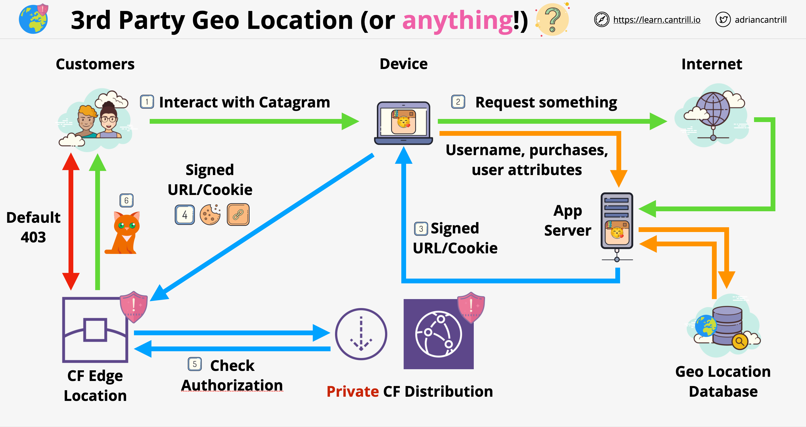

# CloudFront

- It is a content deliver network (CDN)
- Its job is to improve the delivery of content from its original location to the viewers of the content
- It is accomplishing this by caching and by using an efficient global network

## CloudFront Terms and Architecture

- **Origin**: the source location of the content, can be S3 or custom origin (publicly routable IPv4 address)
- **Distribution**: unit of configuration within CloudFront, which gets deployed out to the CloudFront network. Almost everything is configured within the distribution directly or indirectly
- **Edge Location**: pieces of global infrastructure where the content is cached. They are smaller than AWS regions. They are way bigger in number than AWS locations and more widely distributed. Can be used to distribute static data only
- **Regional Edge Cache**: larger version of an edge location, but there are fewer of them. Provides another layer of caching
- CloudFront Architecture:
    
- If we are using S3 origins, the region edge location is not used in case there is a cache miss for the edge location. Only custom origin can use the regional edge cache!
- **Origin fetch**: the content is fetched from the origin in case of a cache miss on the edge location
- **Behavior**: it is configuration within a distribution. Origins are directly linked to behaviors, behaviors are linked to distributions
    

## CloudFront Behaviors

- Distributions are units of configuration in CF, lots of high level options are configured on the distribution level:
    - Price class
    - Web Application Firewall attachment
    - Alternate domain names
    - Type of SSL certificate
    - SNI configuration
    - Security policy
    - Supported HTTP versions
    - etc.
- A single distribution can have one (default behavior) or multiple behaviors
- Any incoming request is pattern matched against behavior's pattern
- The default behavior has a wildcard (`*`) pattern and it will match anything that was not matched by other more specific behavior
- Once a request is pattern matched against a behavior, it will become subject ot the behavior's configurations which can be the following:
    - Origin or origin group
    - Viewer protocol policy (redirect HTTP to HTTPS)
    - Allowed HTTP methods
    - Field level encryption
    - Cache directives - we can use:
        - Legacy cache settings
        - Cache policy nad origin request policy (recommended by AWS)
    - TTL (min, max, default)
    - Restrict viewer access to a behavior: sets the entire behavior to restricted or private. If we select this , we need to specify the trusted authorization type, which can be:
        - Trusted key groups (recommended by AWS)
        - Trusted signer (legacy)
    - Compress objects automatically
    - Associate Lambda@Edge function

## TTL and Invalidations

- And edge location views an object as not expired when it is within its TTL period
- More frequent cache hits = lower origin loads
- Default validity period of an object (TTL) is 24 hours. This is defined in the behavior
- Minimum TTL, maximum TTL: set lower or upper values which an individual object's TTL can have
- Object specific TTL values can be set by the origins using different headers:
    - Cache-Control `max-age` (seconds): TTL value in seconds for an object
    - Cache-Control `s-maxage` (seconds): same as `max-age`
    - Expires (Date and Time): expiration date and time
- For all of these headers if they specify a value outside of minimum, maximum range, the min/max value will be used
- Custom headers for S3 origins can be configured in object's metadata
- Cache invalidations are performed in a distribution and it applies to all edge locations (it takes time)
- Cache invalidation invalidates every object regardless of the TTL value, based on the invalidation pattern
- There is a cost allocated when invalidation is applied. This cost is the same regardless of the number of files we invalidate
- Instead of invalidation we may consider **versioned file names**
- Versioned file names also help to:
    - Avoid using local browser cache in case of a newer file
    - Help improve logging
    - Reduce cost, no need for manual invalidation
- S3 object versioning and versioned file names should not be confused!

## CloudFront and SSL

- Each CF distribution receives a default domain name (CNAME)
- HTTPS can be enabled by default for this address
- CF allows alternate domain names (CNAME)
- Process of adding alternate domain names:
    - If we use HTTPS, we need a certificate applied to the distribution which matches that name
    - Even if we don't want to use HTTPS, we need a way verifying that we own and control the domain. This is accomplished by adding an SSL certificate which matches the the name we are adding to the CF distribution
    - The result is we need to add an SSL certificate wether we are using HTTPS or not
- SSL certificates are imported using ACM (AWS Certificate Manager)
- ACM is a regional service, because of this the certificate for global services (such as CF) needs to be imported in *us-east-1* region
- Option we can set on a CF behavior for handling HTTP and HTTPS:
    - We can allow both HTTP and HTTPS on a distribution
    - We can redirect HTTP to HTTPS
    - We can restrict to only allow HTTPS (any HTTP will fail)
- There are two sets of connections when any individual is using CF:
    - Viewer => CF (viewer protocol)
    - CF => Origin (origin protocol)
- Both connections need valid public certificates as well as any intermediate certificates. Self-signed certificates will not work!
- If our origin is S3, we don't have to worry about this certificate for the origin protocol. S3 handles this natively on it own. We don't/can't apply certificates to S3 buckets

## CloudFront and SNI (Server Name Indication)

- Historically every SSL enabled site needed its own IP
- Encryption for HTTP/HTTPS happens on the TCP connection level
- Host header happens after that at Layer 7. It allows to specify to which application we want to connect in case multiple applications run on the same server
- TLS encryption happens before deciding which application we want to access
- In 2003 an extension was added to TLS: SNI - allowing to specify which domain we want to access. This occurs in the TLS handshake, before HTTP being involved
- This allows one server with a single IP to host many HTTPS websites which need their own certificates
- Older browser do not necessary support SNI. CF needs to allocate dedicated IP addresses for these users, at extra charge
- CF can be used in SNI mode (free) or allocating extra IP addresses ($600 per month per distribution)
- CloudFront SSL/SNI architecture:
    
- For S3 origin, we don't need to apply certificates for the origin protocol. For ALB/EC2/on-prem we can have public certificates which needs to match the DNS name of the origin

## Origin Types and Architecture

- Origins are the locations from where CF goes to get content
- If there is a cache miss in case of a request, than an origin fetch occurs
- Origin groups allow us to add resiliency. We can group origins together an have an origin group used by the behavior
- Categories of origins:
    - Amazon S3 buckets
    - AWS media package channel endpoint
    - AWS media store container endpoint
    - everything else (web-servers) - custom origins
- If S3 is configured to be used as a web-server, CF views it as a custom origin
- S3 origin configuration options:
    - Origin Path: we can use a path from the bucket instead of the top level of the bucket
    - Original access control settings: it is used to restrict access to the bucket only to CloudFront. The legacy version of this was Origin Access Identity
    - Origin Access Identity (legacy): same purpose as the origin access control
    - Add custom headers (optional): we can pass custom headers to the origin S3 bucket
- In case of S3 the viewer protocol is matched with the origin protocol. This means if we use HTTP for the end-users, CF will also use HTTP to access the bucket
- Custom origin configuration options:
    - Origin Path: we can configure to use a sub-path to access the origin
    - Minimum Origin SSL Protocol: minimum TLS protocol version to be used with the origin. Best practice is to select the latest supported by the origin
    - Origin Protocol Policy: HTTP only, HTTPS only or Match Viewer protocol policy
    - HTTP/HTTPS Port: we can use arbitrary port instead of 80 or 443 for being able to connect to the origin
    - Origin Custom Headers: pass custom headers to the origin. Can be used for security to restrict access only from CF

## Caching Performance and Optimization

- Cache Hit: object is available in the cache in the edge location
- Cache Miss: object is not available in the cache, origin fetch is required
- To increase performance we need the maximize the ration between cache hit and cache miss
- We can retrieve objects from CF based on these:
    1. When we require an object from CF, we usually request it using its name
    2. We can use query string parameters as well, example `index.html&lang=en`
    3. Cookies
    4. Request Headers
- When using CF all of this data reaches CloudFront first and than can be forwarded to the origin
- We can configure CF to cache data based on some or all of these request properties
- These choices affect how performant would be the data retrieval from our CF distribution
- Optimization recommendations:
    - When using CF we should forward only the headers needed by the application and cache data based only on what can change the object
    - The more things are involved in caching, the less efficient the process is

## CloudFront Security

### OAI/OAC and Custom Origins

- S3 origins:

    - OAI - Origin Access Identity (legacy): 
        - Is a type of identity, it can be associated with CloudFront distributions
        - Essentially the CloudFront distributions "becomes" the OAI, meaning that this identity can be used in S3 bucket policies
        - Common pattern is to lock the S3 bucket to be only accessible to CloudFront
        - The edge locations gains the attached OAI identity, meaning they will be able to access the bucket
        - Direct access from the end-user to the bucket content can be disabled with a bucket policy
        - OAIs can be created and used one many CF distributions and many buckets at the same time. It is easier to manage one OAI with one CF distribution
    - OAC -  Origin Access Control (recommended):
        - Used for the same purpose as OAI - restrict access to bucket to CF only
        - If enabled CF will sign each request to S3 bucket
        - Once enabled, we will have to adjust the bucket policy to allow request from the CF distribution
- Custom origins:
    - We can not use OAI to control access!
    - We can utilize custom headers, which will be protected by the HTTPS protocol. CloudFront will be configured to send this custom header
    - Other way to handle CloudFront security from custom origins is to determine the IP ranges from which the request is coming from. CloudFront IP ranges are publicly available

### Private Distributions

- CloudFront can run in 2 different modes:
    - Public: can be accessed by any viewer
    - Private: requests to CloudFront needs to be made with a signed url or cookie
- If the CloudFront distribution has only 1 behavior the whole distribution is considered to be either public or private
- In case of multiple behaviors: each behavior can be either public or private
- There are 2 ways two configure private behaviors in CF:
    - The old way: in order to enable private distribution of content, we need to create a **CloudFront Key** by an Account Root User. That account is added as a **Trusted Signer**
    - The new (preferred) way:
        - Create Trusted Key Groups and assign them signers
        - They key groups determine which keys can be used to create signed urls and signed cookies
        - Few reasons we might use this compared to the legacy approach:
            - We don't need the root user from the account to manage CF keys
            - We can manage keys groups with CF API and we can associate a higher number of keys with our distribution/behavior giving us more flexibility
- Signed URLs vs Cookies:
    - Signed URLs provide access to one particular object
    - We should use signed urls if the client does not support cookies
    - Signed cookies can provide access to groups of objects or all files of a particular type
    - With signed cookies we can maintain the application's URL if this is important

### CloudFront Geo Restriction

- Gives a way to restrict content to a particular location
- They are 2 types of restriction:
    - CloudFront Geo Restriction:
        - Whitelist or Blacklist countries
        - **Only works with countries!**
        - Uses a GeoIP database with 99.8% claimed accuracy
        - Applies to the entire distribution
        
    - 3rd Party Geolocation:
        - Completely customizable, can be used to filter on lots of other attributes, example: username, user attributes, etc.
        - Requires an application server in front of CloudFront, which controls weather the customer has access to the content or not
        - The application generates a signed url/cookie which is returned to the browser. This can be sent to CloudFront for authorization
        

### Field-Level Encryption

- We can configure encryption ath the edge location for certain fields from the request using a public key
- Useful for encrypting sensitive data such as passwords, payment information, etc. at the edge locations
- Field-Level encryption happens separately from the HTTPS tunnel
- A private key is needed to decrypt individual fields
- Decryption of the encrypted fields can be done at the origin, if necessary
- Field-Level encryption architecture:
    

## Lambda@Edge

- Lambda@Edge allows us to run lightweight Lambda functions at the edge locations
- These Lambda functions allow us to adjust data between the viewer and the origin
- Lambda functions running at the edge don't have the full Lambda feature set:
    - Currently only NodeJS and Python are supported
    - Functions don't have access to any resources in a VPC, they run in AWS public space
    - Lambda Layers are not supported
- They have different size and duration limits compared to classic Lambda functions:
    - Viewer side: 128 MB limit in size / function timeout is 5 seconds
    - Origin side: function size is the same as classic Lambda / function timeout is 30 seconds
- Lambda@Edge use cases:
    - A/B testing - generally done with Viewer Request function. Lambda function can view the request from the viewer and can modify the response accordingly
    - Migration between S3 origins - generally done with an Origin Request function
    - Different objects based on the type of device - generally done with an Origin Request function
    - Content displayed by country - generally done with an Origin Request function
    - More examples: [https://docs.aws.amazon.com/AmazonCloudFront/latest/DeveloperGuide/lambda-examples.html#lambda-examples-redirecting-examples](https://docs.aws.amazon.com/AmazonCloudFront/latest/DeveloperGuide/lambda-examples.html#lambda-examples-redirecting-examples)