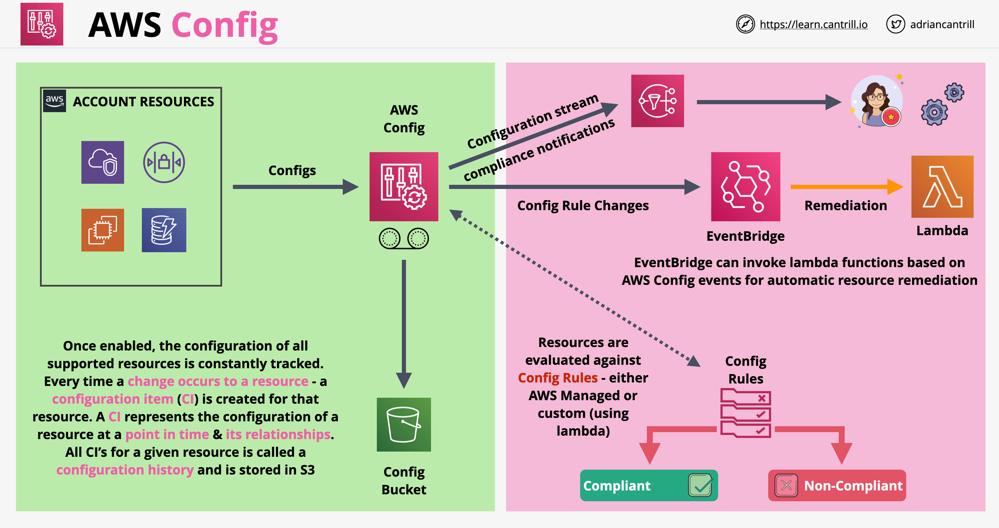

# AWS Config

- AWS Config has 2 main jobs:
    - Primary: record configuration changes over time on AWS resources. Every time a configuration is changed on a resource a configuration item is created which stores the change at that specific point in time
    - Secondary: auditing of changes, compliance with standards
- Config does not prevent changes from happening! It is not a permissions product or a protections product. Even if we define standards for resources, Config can check the compliance against those standards, but it does not prevent us from braking those standards
- Config is a regional service, supports cross-region and cross-account aggregations
- Changes can generate SNS notifications and near-realtime events via EventBridge and Lambda
- Config stores changes historically in a consistent format in an S3 product bucket
- Config recording has to be manually enabled!
- Config Rules:
    - Can be AWS managed ones or user defined using Lambda
    - Resources are evaluated against these rules determining if there are compliant or non-compliant
    - Custom Rules use Lambda, the function does the evaluation and returns the information back to Config
- Config can be integration to EventBridge which can be used to invoke Lambda functions for automatic remediation
- Config can also have integration with SSM to remediate issues
- AWS Config architecture:
    

## AWS Config Remediations

- Nom-compliant resources can be remediated automatically using System Manager Automation documents
- AWS Config provides a set of managed automation documents with remediation actions. We can create custom remediation documents

## Conformance Packs

- A conformance pack is a collection of AWS Config rules and remediation actions that can be deployed as a single entity in an account/region or across an AWS Organization
- Conformance packs are created by authoring a YAML template that contains a list AWS Config rules and remediation actions